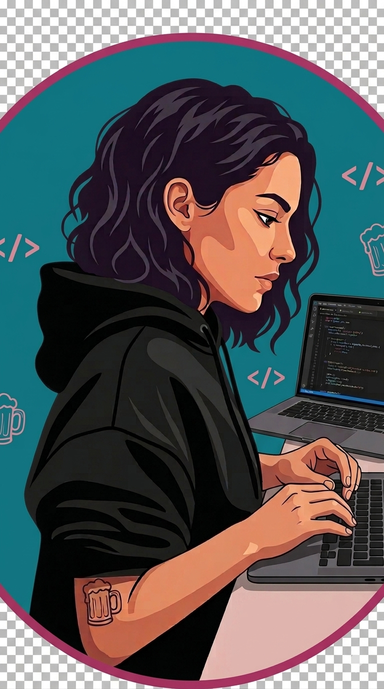

<!-- HEADER: Typing animation -->
<h1 align="center">
  
  Web Developer
  
</h1>

  

---

<!-- SECTION 1: About Me (left) + Photo (right) -->
<table>
<tr>
<td valign="top" width="60%">

### 💻 About Me

- 🚀 Operations Leader with 9+ years of experience leading teams and driving business performance
- 💻 Currently building my career in Software Development with a focus on Frontend technologies
- 🌱 Learning React and modern JavaScript development
- 🎯 Passionate about creating intuitive, user-friendly and responsive web applications
- ☁️ Exploring AWS and cloud technologies
- 📊 Transitioning into Data Analytics with hands-on experience in SQL, Python, Power BI and AWS
- 📍 Medellín, Colombia
- 🇺🇸 English Level: B2 — Professional Working Proficiency

</td>
<td valign="top" width="40%" align="center">

</td>
</tr>
</table>

---

<!-- SECTION 2: Coding GIF (left) + Tech Stack (right) -->
<table>
<tr>
<td valign="top" width="50%" align="center">

</td>
<td valign="top" width="50%">

### 🛠 Tech Stack

**Languages**
 

**Cloud & Data**
 

**Dev Tools**
 

</td>
</tr>
</table>

---

<!-- SECTION 3: Professional Background (centered) -->
<h3 align="center">🏆 Professional Background</h3>

  👩‍💼 Operations Coordinator &nbsp;|&nbsp; 👩‍💼 Operations Supervisor &nbsp;|&nbsp; 👩‍💼 Team Leader

  
  
  
  
  
  

---

<!-- SECTION 4: Currently Learning (centered) -->
<h3 align="center">📚 Currently Learning</h3>

  
  
  
  
  
  
  

---

<!-- SECTION 5: GitHub Stats (centered) -->
<h3 align="center">📊 GitHub Stats</h3>

  
  

---

<!-- SECTION 6: Connect (centered) -->
<h3 align="center">📫 Connect with Me</h3>

  
  &nbsp;
  
  &nbsp;
  

